# UPI AND OSINT Reconnaissance

## Introduction & Executive Summary
**Author:** Nabeel, Security Researcher, nabeel@soobik.com

#### 1. Background & Context
The Unified Payments Interface (UPI) ecosystem, managed by the National Payments Corporation of India (NPCI), has evolved into one of the world's largest real-time payment networks. To ensure seamless transaction routing and foster trust between transacting parties, Third-Party Application Providers (TPAPs) such as Google Pay, Amazon Pay, PhonePe, and CRED frequently surface transaction metadata, beneficiary display names, and payment routing feedback to remitters.

#### 2. Problem Statement
While individual payment applications implement localized user interface (UI) obfuscation and data masking rules, the ecosystem lacks unified, server-side data sanitization standards. This research demonstrates how an adversary can exploit architectural inconsistencies across distinct TPAPs to execute targeted, non-invasive reconnaissance. By analyzing the fragmented metadata exposed during pre-transaction lookups, nominal payment executions, and side-channel error handling, a threat actor can systematically bypass local UI-level masking con

#### 3. Research Objectives & Methodology
This research presents a formal analysis of **"UPI Mosaic Reconnaissance"** a methodology leveraging pattern recognition, cross-application metadata correlation, and business logic abuse. The key objectives of this study are to:
- **Expose Metadata Aggregation Vectors**: Document how isolated parameters exposed across different TPAPs (e.g., avatar photos, ecosystem usernames, and partial VPA strings) can be synthesized to reverse-engineer full Virtual Payment Addresses (VPAs).
- **Demonstrate Financial Graphing Capabilities**: Detail how pre-fetch API mechanisms and default receiving account behaviors allow an investigator to map a target's primary bank accounts and linked RuPay credit instruments without executing unauthorized transfers.
- **Evaluate Payload & Error Side Channels**: Analyze direct data leaks occurring via raw QR code parameters and payment rejection error responses.
- **Propose Systemic & Regulatory Mitigation**: Highlight compliance gaps within current mandates (including NPCI Circular `NPCI/UPI/OC-234/2026-27`) and outline architectural defense strategies for developers and policy architects.
All observations and data points referenced throughout this report were gathered exclusively through passive observational methods, self-controlled accounts, and authorized security testing workflows.

## 1. Technical Foundations: Key Terminology & Architecture
- **UPI (Unified Payments Interface):**  The real-time payment protocol managed by NPCI that replaces traditional bank account details with simple digital aliases.

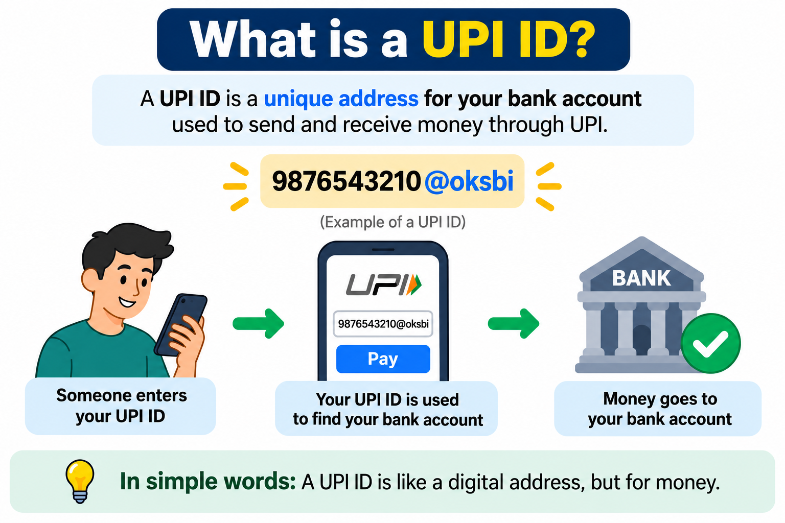

- **VPA (Virtual Payment Address):** The primary identifier/alias used for routing payments (e.g., `username@handle`). This serves as the main **OSINT Pivot Point**.

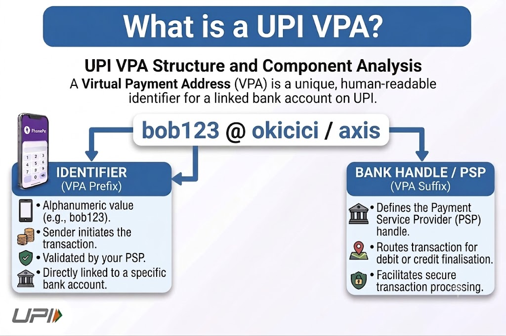

- **PSP (Payment Service Provider) & TPAP (Third-Party Application Provider):  TPAP:** Front-end payment applications (e.g., Google Pay, PhonePe, Paytm, Amazon Pay).  **PSP:** The partner banking infrastructure powering the TPAP (e.g., ICICI, Axis, SBI, Yes Bank).   
- **NPCI UPI Mapper:** The central lookup database that routes money sent via a phone number to a user's chosen primary payment app. 

## 2. Fundamentals of UPI Identifiers & Prefix Derivation
Here, we can broadly categorize UPI ID derivation into three main formats: **email-based identifiers, phone-number-based identifiers, and custom identifiers**.
- **Email-based:** Primarily used by Google Pay (GPay), where the UPI ID may be derived from the user's email-related identifier.
- **Phone-number-based:** A common format used by several UPI applications, where the user's registered mobile number is incorporated into the UPI ID.
- **Custom identifiers:** Some UPI applications generate or allow identifiers based on custom usernames or other naming conventions. In certain cases, these custom formats may also be used as the default UPI ID.
The exact derivation method depends on the UPI application, account configuration, and the user's selected identifier.

### **2.1 Email-Driven VPA Derivation:**
During Google Pay account creation and usage, the application may derive the user's Virtual Payment Address (VPA) identifier from information associated with their Google Account. 
In particular, the Gmail username/prefix can be used as part of the VPA generation process, allowing the resulting payment identifier to be automatically created based on the user's existing Google account identity rather than requiring the user to manually choose a separate identifier.

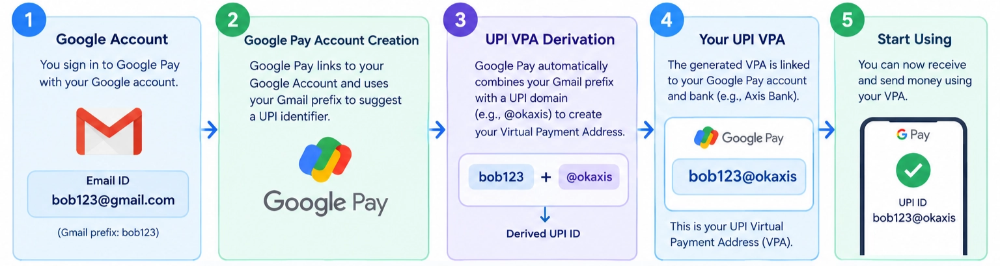

This is how **Google Pay Derive UPI** Identifire from **Email ID**
If a UPI ID is deterministically derived from a Gmail username, the relationship may work in both directions: a UPI ID can potentially be used to infer the associated email address, while the email address may be used to derive or predict the UPI ID. This depends on the specific VPA-generation mechanism.

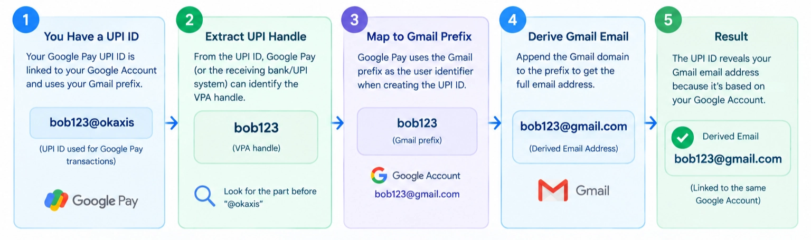

There may be exceptions where a user’s Gmail username does not correspond to the identifier used in their email address or other online services. However, in many cases, users tend to use the same or a closely related username across different services.
**Common examples:**
- Gmail: `bob123@gmail.com` → Username: `bob123`
- Gmail: `john.smith@gmail.com` → Username: `john.smith`
- Gmail: `alex1998@gmail.com` → Username: `alex1998`
**Examples of exceptions:**
- Gmail: `bob123@gmail.com` → Other identifier: `robert456`
- Gmail: `john.smith@gmail.com` → Other identifier: `js789`
- Gmail: `alex1998@gmail.com` → Other identifier: `alexander01`
Therefore, while this correlation may not work for every user, cases where the same or a closely related username is reused across services can potentially allow an exposed identifier to be correlated with an associated email address.

### 2.2 Phone-Number-Driven VPA Derivation
This is common mapping mainly happens but from overall apps In here we take **PhonePe** as example.
A VPA handle formatted as `9876543210@ybl` directly leaks the user's mobile phone number `9876543210`.  

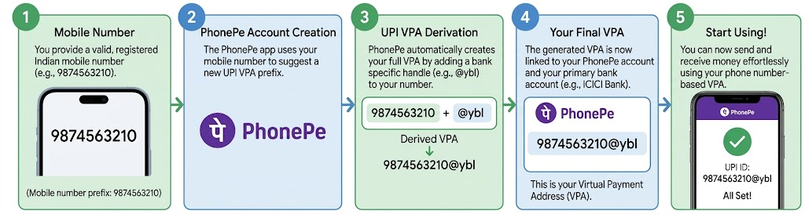

If a UPI ID is deterministically derived from a user's phone number, the relationship may work in both directions: the UPI ID can potentially reveal or help infer the associated phone number, while the phone number may be used to derive or predict the corresponding UPI ID. This depends on the specific UPI app and VPA-generation mechanism. 

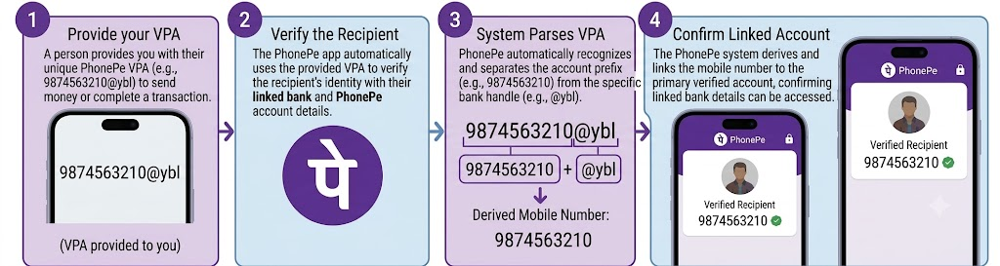

- Using the identified method, a phone number can be associated with a specific, verified bank account.

### 2.3 Custom Identifier Driven VPA Derivation 
Some UPI applications allow users to create VPAs using custom handles, and in certain cases, these identifiers may be assigned as the default VPA. Because custom VPAs are not necessarily generated from a predictable data source, directly reversing or deriving the underlying account information can be difficult.
However, custom identifiers may still contain patterns based on common human behavior. Since UPI IDs are frequently used as public-facing payment identifiers, users may choose names, numbers, or combinations that are familiar or meaningful to them. For example:
- **Name-based:** `bob123@upi`, `bob.light@upi` : Uses a name, nickname, or personal identifier.
- **Date-based:** `bob1998@upi` : `1998` could represent a birth year in **YYYY** format.
- **Phone-related:** `bob9876@upi` : `9876` could represent the last four digits of a phone number.
- **Vehicle-related:** `bobcar21@upi` : `21` could represent a vehicle-related number, such as a registration or model identifier.
- **Occupation/hobby-based:** `bobcoder@upi` : `coder` may represent the user's profession, skill, or hobby.
- **Frequently reused identifier:** `bob4521@upi` : `4521` could be a personally meaningful or frequently reused number across different services.
Similar patterns are commonly observed when users create email addresses and other online usernames. Therefore, although a custom VPA may not be directly reversible, correlations may sometimes be established by identifying reused usernames, meaningful numbers, and other publicly observable patterns. When multiple independent data points align, these behavioral patterns can potentially help connect otherwise separate identifiers.

### 2.4 App & Bank Fingerprinting via PSP Handles

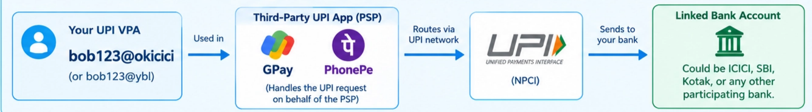

#### **TPAP Handles (`@okicici`, `@ybl`, etc.)**
• **Indication of App Association, Not the User's Bank**     ◦ Suffixes such as `@okicici` or `@ybl` primarily reveal the front-end application and the partnering Payment Service Provider (PSP) bank handling the infrastructure.        ◦ For instance, `@okicici` indicates that Google Pay utilizes ICICI Bank as its back-end PSP for transaction routing, while `@ybl` typically points to Yes Bank. • **Insights into User Preference**     ◦ These handles indicate which ecosystem or third-party application (such as Google Pay, PhonePe, or Amazon Pay) the user prefers for initiating transactions.        ◦ They provide app-based behavioral insights rather than exposing the user’s primary banking institution, as a user can link virtually any bank account to these applications regardless of the handle's suffix.

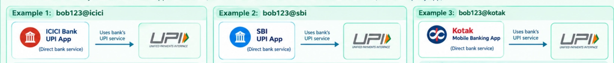

#### **Direct Bank Handles (`@kotak`, `@icici`, `@axis`, `@sbi`)**
- **Direct Association with the Bank's Ecosystem**
	- Handles matching a bank's native identifier indicate that the user is interacting directly through that specific financial institution's proprietary UPI application (e.g., YONO SBI, iMobile ICICI, or Kotak Mobile Banking).
	Example: 
	

| **Bank Name** | **UPI Handle Suffix** | **Native Bank UPI Application** |
| --- | --- | --- |
| **State Bank of India (SBI)** | `@sbi` | YONO SBI / BHIM SBI Pay |
| **ICICI Bank** | `@icici` | iMobile Pay |
| **Kotak Mahindra Bank** | `@kotak` | Kotak Mobile Banking App |
| **Axis Bank** | `@axis` | Axis Mobile |
| **HDFC Bank** | `@hdfc` | HDFC NetBanking / PayZapp |

- **Direct Proof of a Banking Relationship or Service**
	- Unlike third-party handles, a direct bank VPA strongly implies an existing relationship with that institution.
	- The user either maintains an active bank account with them or utilizes a specific financial service/product offered by that exact bank, as native apps require direct verification through the bank's internal core systems without relying on an intermediate third-party PSP.

### 2.5 Specific Scenarios: 

### **Scenario 1: Identifying UPI Application and Banking Signals from an Observed Handle**
If a user's mobile number is already known and a UPI identifier associated with that number is observed, the UPI handle or suffix provides valuable behavioral and infrastructural insights. However, the nature of these insights depends entirely on whether the handle belongs to a **Third-Party Application Provider (TPAP)** or a **Direct Bank Native Application**.

#### **1. TPAP-Facilitated Handles (App-Level Signals)**
- An identifier ending in a TPAP suffix points to the front-end application and its partner Payment Service Provider (PSP) routing arrangement rather than the user's home bank.
- **Examples of TPAP Signatures:**
	- `@okicici` / `@okaxis` / `@okhdfcbank` / `@oksbi` → Google Pay ecosystem and its corresponding partner PSP routing.
	- `@ybl` → PhonePe ecosystem and YES Bank PSP routing.
- **Interpretation:** These should be treated as application-level attribution signals indicating that the user interacts with that specific fintech ecosystem. Google Pay and other TPAPs explicitly state that a customer can link an account from any bank (e.g., an SBI account) regardless of whether the suffix is `@okicici` or `@okaxis`. NPCI’s architecture cleanly separates the PSP role from the customer’s actual remitter bank account.

#### **2. Direct Bank Native Handles (Account/Service-Level Signals)**
- Handles that match a bank's distinct identifier indicate that the user is transacting directly through that financial institution's proprietary mobile banking application.
- **Examples of Direct Bank Signatures:**
	- `@sbi` → SBI native application (e.g., YONO SBI).
	- `@icici` → ICICI Bank native application (e.g., iMobile Pay).
	- `@kotak` → Kotak Mahindra Bank native application.
	- `@axis` → Axis Bank native application.
- **Interpretation:** Unlike TPAP handles, a direct bank VPA strongly implies an active banking relationship. Because native bank apps require internal core system verification without an intermediate third-party PSP, observing a direct bank handle suggests the user holds an active account or utilizes specific financial services with that exact institution.

### Scenario 2 : Application-Specific UPI Handle as a Service-Usage Indicator
If the observed UPI suffix is **application-specific**, it can provide additional context about the type of financial service or ecosystem with which the identifier is associated.
For example, **`@yescred` is listed by YES BANK as a UPI handle for CRED**. CRED is primarily positioned around credit-card management, credit-card bill payments, credit scoring, rewards, and related financial services, while also providing UPI functionality.
Therefore, an observed identifier such as:
**`username@yescred`**
can reasonably provide an **application-level signal that the UPI identifier is associated with CRED**.
From an analytical perspective, this may indicate that the user has an association with or has used CRED's services. Because CRED's services include credit-card management and bill-payment functionality, the observation can provide **context suggesting possible use of credit-related services**.
However, this should **not** be interpreted as proof that the person currently owns or uses a credit card. The UPI handle identifies the CRED/PSP relationship; it does not disclose the user's complete financial profile or the specific financial products they hold.
This makes application-specific handles potentially more informative than generic UPI identifiers when performing **high-level application/ecosystem attribution**.

### Scenario 3 : UPI Handle Enumeration
If we already know a user's UPI ID or phone number, different UPI handles can potentially be tested against the same identifier.
For example:
`number@ybl`
`number@yescred`
If a matching UPI ID exists, the handle can provide a signal about the associated UPI application or PSP ecosystem.
This approach works mainly when the application uses a predictable identifier such as a mobile number or recognizable VPA. It may fail when the user has a **custom VPA, randomized identifier, or different UPI ID structure**.

## 3. Multi-Account Mapping & Routing Mechanics

### 3.1 Multi-Account Suffix Enumeration

#### 3.1.1 UPI VPA Suffix Variation
Some UPI applications, such as **Google Pay **as example, may append a suffix such as **`-1`** to the main VPA identifier when the preferred identifier is already unavailable.

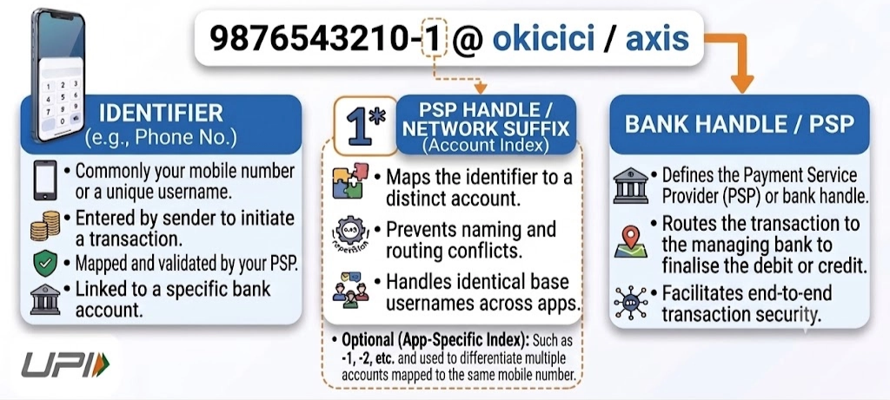

Examples:
- `9876543210@upi` : `9876543210-1@upi`
- `bob123@upi` : `bob123-1@upi` 
This can occur when Application cannot claim the preferred VPA because that identifier is already registered or unavailable within the relevant UPI/PSP namespace.
Possible situations include:
1. **Changing UPI applications** : the previous application may still retain or have registered the original VPA.
2. **Multiple bank accounts or UPI registrations** : the same identifier may already be associated with another VPA.
3. **Multiple UPI IDs for the same account** : an alternative identifier may be generated when the preferred one is already occupied.
4. **Identifier collision** : another existing registration may already have claimed the preferred VPA.
Therefore, a suffix such as `-1` may indicate that the preferred VPA was unavailable and an alternative identifier was generated. If that identifier is also occupied, the application may continue with the next available variation, such as **`-2`, `-3`, `-4`,** and so on. The exact generation and reuse rules depend on the application and PSP implementation.

### 3.2 Multi VPA (UPI VPA Suffix Enumeration)

	

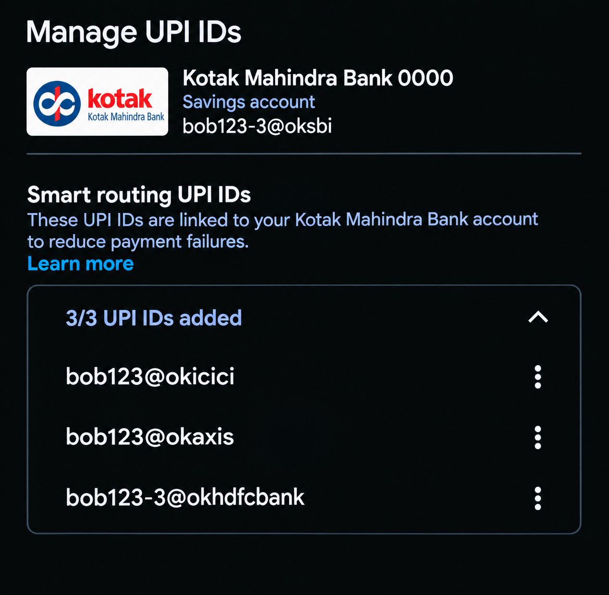

	
	

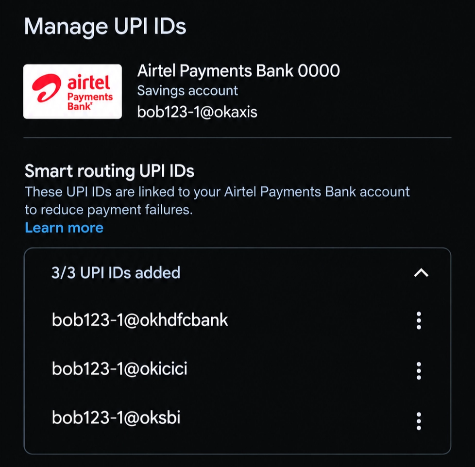

	

	

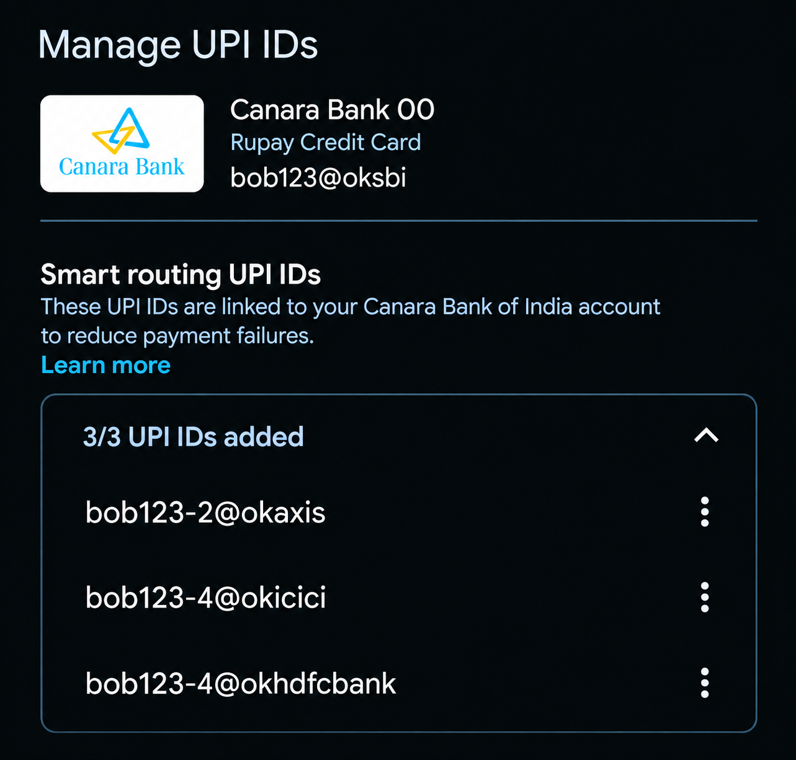

	
	

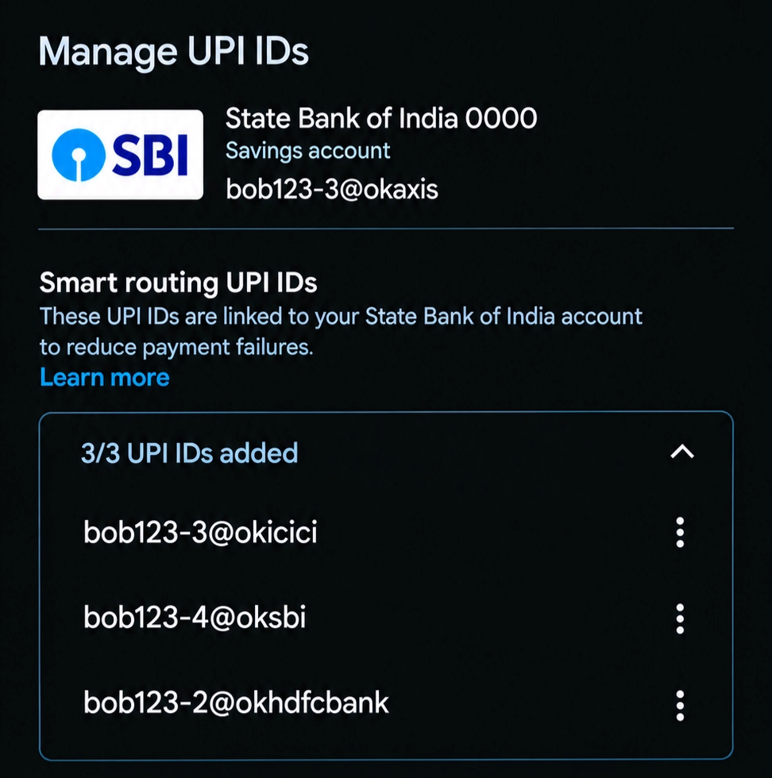

	

If we already know one valid UPI ID belonging to a person, such as `bob123@okhdfcbank`, we can use the known username `bob123` as the starting point. We can then check for other possible UPI IDs by trying different suffixes, such as `bob123-1@okhdfcbank`, `bob123-2@okhdfcbank`, and `bob123-3@okhdfcbank`. We can also keep the same username and try other supported handles, such as `bob123@okaxis`, `bob123@okicici`, and `bob123@oksbi`.
For example, from the UPI IDs shown above, we could have `okbob123@okaxis` for Kotak, `okbob-1@okaxis` for Airtel Bank, `bob123-2@okaxis` for the Canara Bank RuPay Card, and `bob123-3@okaxis`. If one of these IDs is found to be valid, we can use the same approach to check for additional variations and handles.
Therefore,  we can use the known username and available handle patterns to identify other valid UPI IDs associated with the connected bank accounts or RuPay cards. The system could then enumerate the discovered UPI IDs and map each one to its respective connected account or RuPay card, provided the lookup is authorized and supported by the UPI system. This check is also usable for 9876543210@axis to 9876543210@ybl or 987654321-1@ybl enumeration too.

### 3.3 Single VPA (UPI VPA Suffix Enumeration)
- **Architecture**: Some Apps like WhatsApp UPI, Amazon pay bind a single primary VPA to the registered phone number (e.g., `@waicici`). Incoming payments route to whichever account is currently designated as the primary/default account, shifting dynamically without requiring new VPA strings.
- **Enumeration Constraints**:
	- **No Static Footprint**: Because only one primary VPA exists, we cannot harvest permanent auxiliary handles or numeric index suffixes (`1`, `2`).
	- **Point-in-Time State Visibility**: While dynamic architectures prevent a comprehensive multi-VPA sweep, we can still perform real-time checks to identify whichever bank is actively linked at that exact moment.
	- **User-Dependent Mapping**: Because observed shifts reflect manual user toggles rather than a static multi-account footprint, our visibility remains bound to the user's active app state at the time of the query.
We can only enumerate here point-in-time mapped account in this architecture base but still if it changed in time we still observe it.

### 3.4 Cross-Platform vs Same Platform UPI ID Exposure

####  Intra-Platform vs. Inter-Platform Masking Mechanics
- **Intra-Platform Transactions (e.g., Google Pay to Google Pay)**: Within the same app ecosystem, platforms often hide phone numbers and fully mask UPI identifiers for unknown or uncontacted senders (e.g., when there is no prior connection history) to protect user privacy. However, implementation varies widely some apps mask these details correctly, while others fail to obscure intra-platform data.
- **Inter-Platform Transactions (e.g., Paytm or other TPAPs paying a Google Pay user)**: Conversely, cross-platform routing often bypasses these front-end abstraction layers. As observed in inter-platform transfers, transaction logs frequently expose unmasked UPI identifier (e.g., displaying full handles such as `9876543210@ptypes`) and sender metadata directly without hiding the underlying phone number structure.

Regardless of whether a transaction is intra-platform or inter-platform, many applications fail to apply masking correctly due to varied development logic, distinct handling of payload metadata. Consequently, raw, unmasked UPI IDs  are frequently exposed across various apps for no uniform reason other than poor implementation standards or mainly those platform thoughts for double verification of user with their upi id before starting a transcation can be reason these are shown to us.
Because of these inconsistent masking implementations across cross-platform or poorly secured intra-platform transactions, a tester or investigator can easily harvest the unmasked UPI ID (such as a mobile-number-based VPA) of an otherwise unknown or anonymous payer directly from the transaction log.

### 3.5 Real Name Resolution (UPI ID / Phone Number $`\rightarrow`$ Legal Name)

#### **3.5.1 Legitimate Verification Mechanism**: 
Real name resolution is a built-in feature of the UPI ecosystem designed for user verification. When a remitter enters a VPA or mobile number, the system queries the central switch to display the registered beneficiary's legal or display name, allowing remitters to confirm they are paying the correct party before authorizing a transfer.

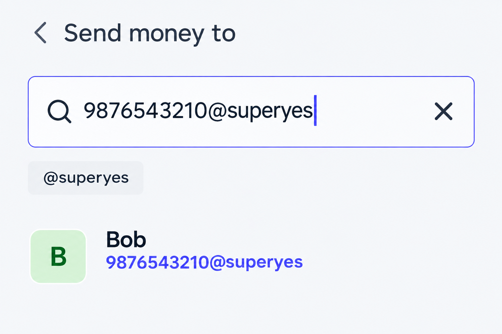

While intended as a security guardrail against misdirected funds and fraud, this feature is frequently leveraged for technical reconnaissance and OSINT validation. If an investigator or tester has obtained a target VPA or phone number through data leakage  passing that identifier into a UPI transfer prompt allows them to instantly resolve and verify the underlying legal identity tied to the account.

#### **3.5.2 Extra Verification from TPAPs:**
Beyond standard banking name resolution, certain TPAPs introduce an additional layer of personal data exposure. As observed in app lookup interfaces, querying an identifier can expose extended identity metadata such as the user's public Google profile picture, username, masked phone number, and account creation timeline (e.g., *Joined September 2021*) directly alongside the verified **"Banking name"**.

While these visual elements (profile avatars and usernames) are built into the app's intended design to help users verify known contacts, they function as a privacy extension during technical reconnaissance. When an unknown identifier is queried, they act as an extra layer of personal metadata, bridging a transactional VPA directly to a broader public online profile.
This will work around with the applications that uses googles api for data will do the mostly same(eg: Cred), Cred have a option to user to connect user gmail id to cred application. This will show same or some what exact data to other cred users.

#### 3.5.3 TPAP Application and it’s Connected eco-system: 
Different digital ecosystems expose and organize user information in different ways, depending on their application architecture and available features. For example, Google Pay provides UPI-related information through its payment interface and google’s eco-system we all know we discussed it before, while WhatsApp offers a different perspective by combining messaging, profile visibility, and UPI payment functionality.
If a person's phone number is known, WhatsApp can potentially be used to determine whether that number is associated with an account, depending on the platform's behavior and privacy settings. If the user's profile picture and other profile details are publicly visible or accessible, these may provide additional identifying context. Furthermore, WhatsApp's built-in UPI functionality may provide a way to examine payment-related identifiers or account details that are exposed through the application's legitimate user interface.
Therefore, each digital ecosystem can serve as a distinct source of user-identification signals, with different data points, visibility rules, and interaction flows. Examining these differences across platforms can help establish how identifiers such as phone numbers, UPI IDs, profile information, and payment-related details are linked, while accounting for platform-specific privacy controls and data-access limitations.

### 3.6 UPI QR via VPA id
1. **Decoding raw URI scheme parameters from static/dynamic UPI QR code**s (`upi://pay?pa=...&pn=...`).   Extracting the unmasked Payee Name (`pn`) parameter directly from payment payloads. 

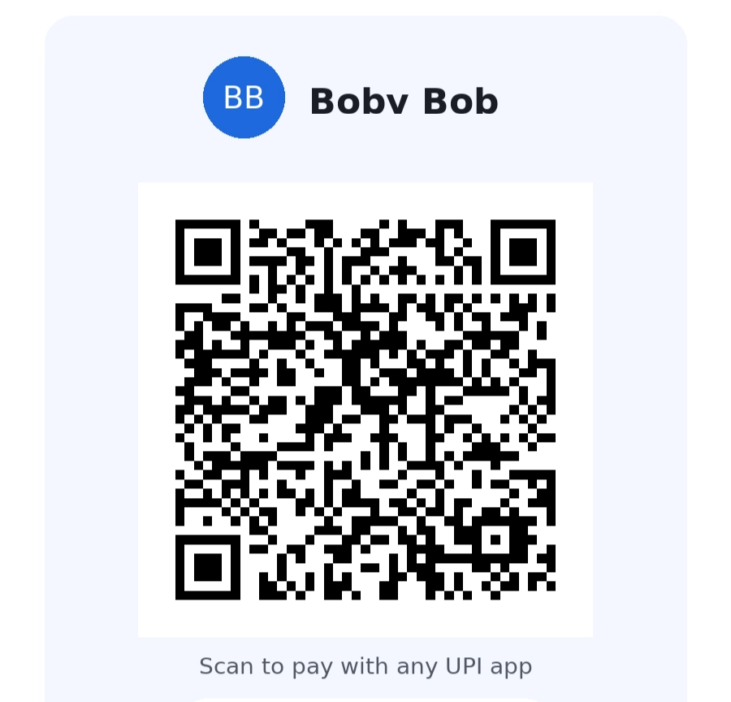

upi://pay?pa=bob123@okaxis&pn=Boby%20Bob&cu=INR 
**Standardized Payload Transparency**: National Payments Corporation of India (NPCI) standards mandate the use of a uniform `upi://pay` URI scheme for generating static and dynamic payment QR codes. Because QR codes are plain-text string encodings, scanning a payment QR code directly exposes the underlying payment payload without requiring authorization or network interaction.  
**Direct Extraction of Unmasked Parameters**: While payment applications may apply UI-level masking (such as hiding parts of a phone number or VPA on screen), the underlying QR payload must retain unencrypted string parameters to allow any compliant UPI app to route the transaction. Key parameters extracted directly from the raw URI payload include:    • `pa` (**Payee Address / VPA**): The exact, unmasked target payment handle (e.g., `bob123@okaxis`).    • `pn` (**Payee Name**): The URL-encoded legal or display name of the recipient (e.g., `Boby%20Bob` -\> `Boby Bob`).    • `cu` (**Currency**): The currency identifier (e.g., `INR`). 

## 4. VPA Permutation & Guessing Methodology

#### 4.1 Predictable Naming Conventions & Human Bias
**Repetitive Formats:** Users frequently rely on predictable standards, personal nicknames, or standard alphanumeric combinations derived from their legal names or phone numbers to create memorable payment handles.

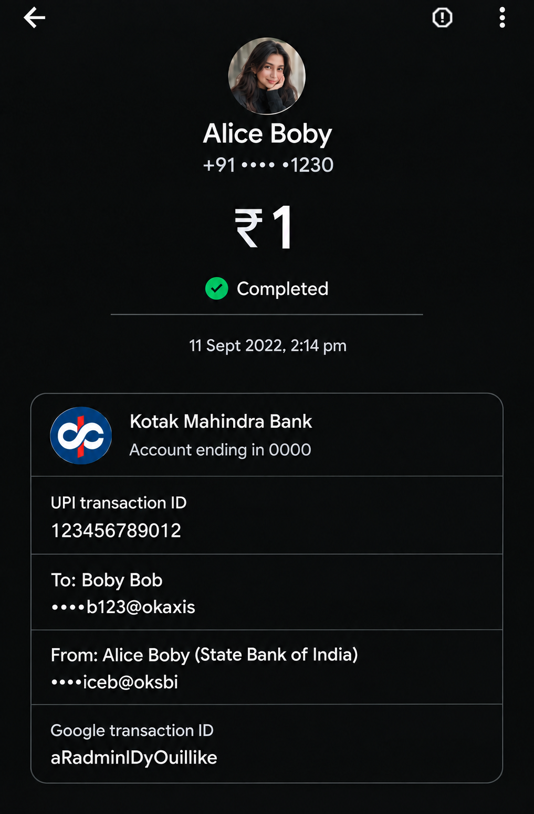

**Metadata Correlation:** As demonstrated in transactional , visible partial strings (such as ...iceb@oksbi or ...b123@okaxis) can be cross-referenced with known name fields (Alice Boby) to deduce the complete VPA permutation. For example, combining the name initials and patterns from Alice Boby with the visible prefix **ice** and SBI handle oksbi allows an analyst to successfully reconstruct the target handle as aliceb@oksbi. Similarly, looking at the secondary transaction log entry showing the target's name as Boby Bob alongside the masked VPA string ...b123@okaxis, an investigator can deduce that the user reused handle patterns based on their name, yielding permutations like boby123@okaxis or bob123@okaxis within the Axis Bank handle space.

#### 4.2 Advanced Pattern Recognition & Suffix Analysis
- **Metadata Synthesis**: By aggregating multiple exposed data points from a single transactional card such as the ecosystem username, the legal name in the 'To/From' fields, and the public avatar an investigator can establish a highly accurate baseline of the target’s digital naming habits.
- **Identifier & Suffix Reuse**: Human behavioral bias leads to the reuse of unique numeric identifiers or suffixes across distinct digital accounts. If a user appends a specific sequence (e.g., `123` or a birth year) to their email (`bob123@gmail.com`), they are statistically likely to reuse that same pattern for their payment handle (`bob123@upi`) which gpay inbuild uses. Identifying these external suffixes often unlocks the exact permutation needed to reconstruct the masked VPA.
- **Inconsistent Obfuscation Algorithms**: There is no standardized method or universal regulatory requirement for masking VPAs across the UPI ecosystem. Because different applications apply divergent masking logic (some exposing prefixes, others exposing suffixes, and some failing to mask at all), an analyst can often rebuild the complete identifier simply by cross-referencing how different TPAPs handle the exact same transaction data.

#### 4.3 Reconstructive Limitations & Complexities
- **Unknown String Lengths**: Standard UI masking often uses a fixed number of asterisks or dots (e.g., `••`) that do not correspond to the actual number of hidden characters. This obscures the exact length of the underlying string, requiring testers to enumerate multiple length combinations of a guessed pattern.
- **Randomized & Disconnected Handles**: The permutation methodology fundamentally relies on predictable human bias. If a user deliberately avoids deriving their VPA from their legal name or ecosystem username opting instead for a randomized alphanumeric string guessing strategies become highly improbable without a secondary, unmasked data leak.

## 5. Pre & Post Bank account or service validation from UPI VPA

### 5.1 Pre-Fetching Bank Details From UPI VPA
**Pre-Transaction Financial Leakage**: Certain TPAP applications (such as Amazon Pay and CRED) implement a feature that pre-fetches and displays the beneficiary's connected bank or financial institution before a transaction is authorized. While designed to reassure the remitter that funds are going to the correct destination, this mechanism acts as an unintended data leak. It allows anyone to identify where a target holds active accounts without ever executing a payment. For example, querying the VPA `bob123@okaxis` in Amazon Pay explicitly reveals a connection to **Kotak Mahindra Bank**.   

	

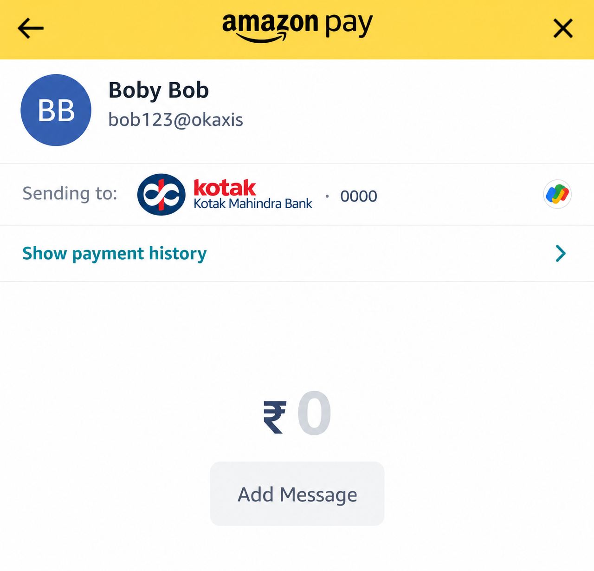

	
	

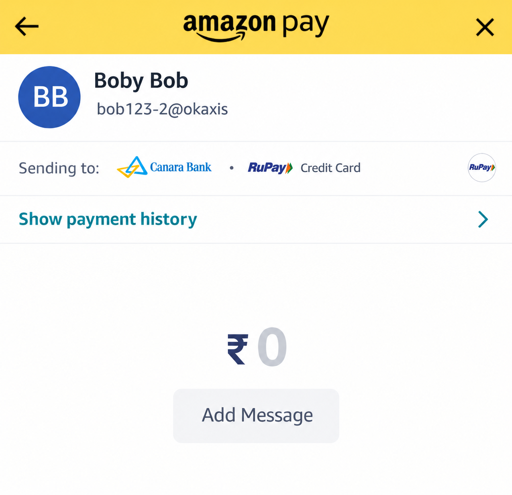

	

**Credit Card Exposure**: This pre-fetch behavior is not limited to standard savings accounts. As the ecosystem has expanded to support credit on UPI, these interfaces will also resolve and display connected credit instruments. Querying a secondary handle like `bob123-2@okaxis` can expose that the user has linked a **Canara Bank RuPay Credit Card**.   
**Financial Graphing via Enumeration**: When combined with VPA suffix enumeration (e.g., iterating through `bob123`, `bob123-1`, `bob123-2`), this pre-fetch mechanism becomes a powerful mapping tool. By methodically resolving permutations of a target's handle, an investigator can construct a comprehensive "financial graph," mapping out multiple banking relationships and credit holdings tied to a single identity.   
**Ecosystem Limitations & Cross-Verification**: This reconnaissance method has known technical constraints:
- **Synchronization Delays**: The pre-fetched bank data may occasionally be outdated due to ecosystem caching. If a user recently changed their default receiving account, it takes time for the central switch to propagate this to all TPAPs.
- **Resolution Failures**: Applications sometimes struggle to accurately resolve routing data for smaller regional banks or niche financial services, either returning blank fields or generic errors.
- **Secondary Validation**: To counter these inaccuracies, we can frequently employ cross-verification by taking the target VPA and querying it across a secondary application to validate if the underlying bank routing data matches the initial discovery.

### 5.2 Post & Receive payment Fetching Bank Details From UPI VPA

#### 5.2.1. Post-Transaction Metadata Exposure (Nominal Payment Verification)
**Receipt-Based Financial Discovery**: Beyond pre-fetch lookups, executing a nominal transaction (e.g., ₹1) or processing an incoming transfer generates a confirmed transaction log. Certain TPAPs (such as Google Pay) expose extended metadata within the transaction receipt that was unverified prior to payment.

**Originating Bank Identification**: As shown in transaction receipts, the interface explicitly appends the originating or receiving financial institution to the entity's name (e.g., `From: Alice Boby (State Bank of India)`). This provides definitive post-transaction confirmation of the target's underlying bank account, validating data gathered during initial pre-fetch or permutation stages

#### 5.2.3 Error-Handling Side-Channel Analysis (Payment Instrument Distinction)
**Rejection Message Leakage**: When initiating a payment, difference in routing logic between standard savings accounts and credit-linked VPAs (such as RuPay Credit Cards on UPI) creates distinct error-handling behaviors.
**Merchant & Bank Constraints**: If a transaction is attempted using a credit-backed instrument against a VPA or merchant that does not support credit-on-UPI transactions, the central switch or gateway returns an explicit failure response (e.g., *"Payment failed as this merchant doesn't accept payment from a RuPay card. Retry using a Bank account?"*).

	

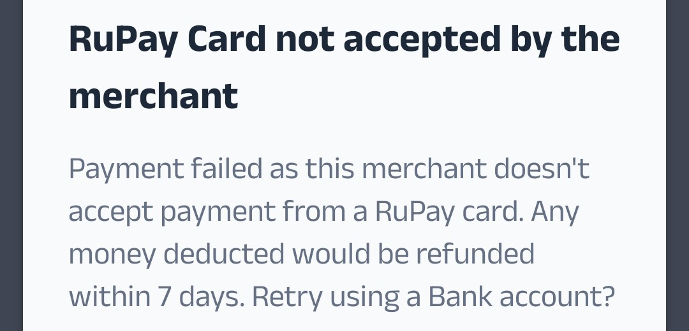

	
	
The behavior was analyzed while attempting a direct RuPay credit-card payment through a standard savings-account UPI flow.
	

**Instrument Fingerprinting**: An investigator can use these explicit error responses as an information-disclosure side channel. By intentionally testing payment attempts across different instrument types, the response behavior confirms the operational constraints and account capabilities tied to the target VPA. 

### 5.3 Default Receiving Account Discovery via Multi-TPAP VPA Resolution
- **Multi-App Account Mapping**: Users frequently install multiple Third-Party Application Providers (TPAPs) such as Google Pay, Amazon Pay, PhonePe, and Paytm and set different primary receiving accounts across each platform (e.g., setting Kotak Mahindra Bank as the default on Google Pay, Axis Bank on Amazon Pay, and ICICI Bank on PhonePe).
- **Application-Specific VPA Routing**: Because distinct TPAPs generate platform-specific VPA handles (e.g., `user@okaxis` for Google Pay, `user@apl` for Amazon Pay, `mobile@ybl` for PhonePe), querying each app-specific handle via pre-fetch resolution mechanisms exposes the specific default receiving bank account bound to that particular app setup.
- **Aggregated Multi-Bank Fingerprinting**: By combining a target's identified username/prefix with various TPAP-specific handles (`@okaxis`, `@oksbi`, `@apl`, `@ybl`, `@paytm`), an we can execute cross-application lookups. Resolving these distinct VPAs systematically uncovers the complete list of financial institutions where the target maintains active accounts.
- **Exploitation of Behavioral Preferences**: This vector leverages standard user configuration habits such as assigning different default accounts for personal spending, business transactions, or secondary funds across separate apps allowing an analyst to reconstruct the target's entire multi-bank profile without ever executing a transaction.

### 5.4 Airtel Upi and Bank Account
During Analysis, I observed that Airtel UPI identifiers commonly follow a format based on the user's registered mobile number, such as `91987654321@airtel`. Based on the enumeration observations described above, the identified UPI identifiers appeared to correlate with the corresponding user records and bank account information within the system.
In particular, the system appears to reuse or derive the bank account identifier from the user's registered mobile number. Consequently, where a valid UPI identifier or phone number is available, it may be possible to infer or enumerate the corresponding bank account number associated with the user.
This creates a potential information-disclosure and account-enumeration concern, as knowledge of a user's UPI identifier or registered phone number could potentially expose sensitive financial account information.

## 6. Architectural Remediation, Policy Compliance Gaps, & Ethical Framework
- **Root Cause: Lack of Standardized Obfuscation**: The fundamental vulnerability across the UPI ecosystem is the non-standardization of metadata display logic. Because individual TPAPs independently decide what information to reveal before, during, and after a transaction, the privacy of the entire switch defaults to the least restrictive application.
- **Regulatory Compliance Drift**: Systemic policy directives exist but suffer from enforcement lag. For example, NPCI issued Circular **NPCI/UPI/OC-234/2026-27** (*Safeguarding User Information in UPI*, issued June 5, 2026, with an effective compliance deadline of September 4, 2026) ordering explicit masking of user data. However, real-world execution remains inconsistent as TPAPs delay client-side UI updates, fail to redact raw payment payload parameters, or leave pre-fetch endpoints exposed.
- **Enforcement Mandates**: Resolving ecosystem-wide mosaic vulnerabilities requires central switch-level enforcement. Beyond issuing policy circulars, governance bodies must mandate server-side data stripping (e.g., enforcing uniform VPA masking before payloads reach the client interface) and conduct automated audit checks on all registered TPAP builds.

### Legal Disclaimer & Ethical Disclosure
- **Scope & Data Verification**: All data, payment handles, and transactional interactions analyzed throughout this research were conducted exclusively using self-owned accounts, explicitly permitted environments, or publicly accessible datasets. No unauthorized data collection, automated harvesting, or unauthorized probing of non-consenting third-party accounts was performed.
- **Synthetic Demonstrations & Privacy Safeguards**: All visual artifacts, screen captures, and Virtual Payment Address (VPA) identifiers depicted in this document are synthetic figures created using generative design tools for illustrative purposes. Any resemblance to real individuals, active payment handles, or live accounts is purely coincidental.
- **Research & Educational Intent**: This documentation is published solely for academic research, threat modeling, and defensive security engineering. The findings are intended to assist payment application developers, security architects, and regulatory bodies in strengthening privacy controls and mitigating business logic vulnerabilities. The author(s) disclaim all legal liability for any unauthorized testing, misuse, or downstream activities conducted based on the information contained in this report.

## Conclusion
The reconnaissance vectors and logic flaws identified in this research demonstrate a critical disconnect between the centralized privacy guarantees of the Unified Payments Interface (UPI) architecture and its fragmented implementation across third-party application providers (TPAPs). While structural constraints like rate limits and failover triggers mitigate brute-force exploitation, they remain insufficient to prevent systemic metadata harvesting, VPA enumeration, and side-channel profile resolution.

